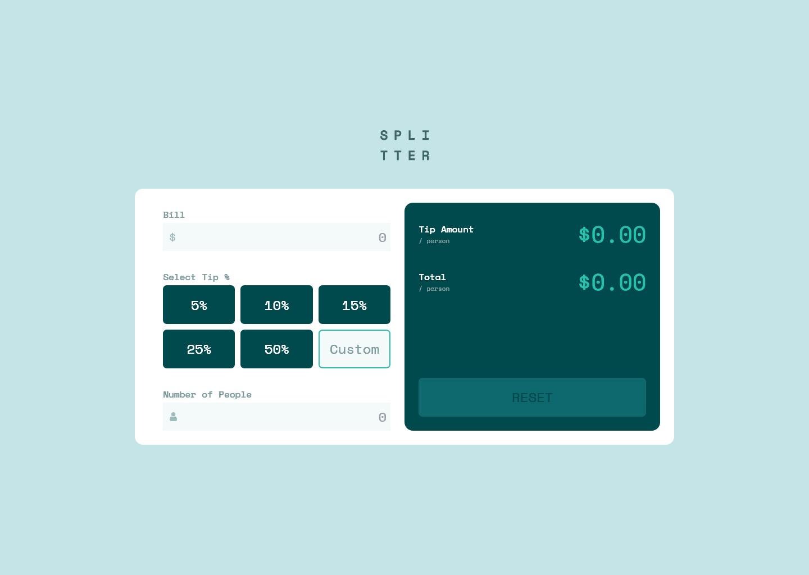
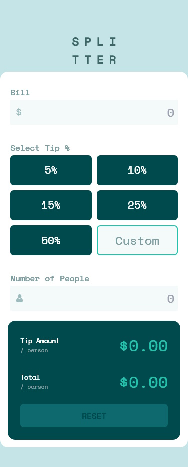

# Frontend Mentor - Tip calculator app solution

This is a solution to the [Tip calculator app challenge on Frontend Mentor](https://www.frontendmentor.io/challenges/tip-calculator-app-ugJNGbJUX). Frontend Mentor challenges help you improve your coding skills by building realistic projects.

## Table of contents

- [Overview](#overview)
  - [The challenge](#the-challenge)
  - [Screenshots](#screenshots)
  - [Links](#links)
- [My process](#my-process)
  - [Built with](#built-with)
  - [What I learned](#what-i-learned)
  - [Known Issues](#known-issues)
  - [Useful resources](#useful-resources)
- [Author](#author)

## Overview

### The challenge

Users should be able to:

- View the optimal layout for the app depending on their device's screen size
- See hover states for all interactive elements on the page
- Calculate the correct tip and total cost of the bill per person

### Screenshots

### Links

- Solution URL: [Source code](https://github.com/theGamingKitten/TipCalculator)
- Live Site URL: [Preview](https://tip-calculator-roan-seven.vercel.app/)

## My process

### Built with

- Semantic HTML5 markup
- CSS custom properties
- Flexbox + Grid
- [React](https://reactjs.org/) - JS library
- [Tailwind CSS](https://tailwindcss.com/) - utility-first CSS framework

### What I learned

- usage of the useState and useEffect hooks

### Known Issues

- Input values of Bill and Number of People don't change back to 0 when clicking "RESET"
- Not an Issue, but I intended to use Tailwind with this project but ended up skipping it for now. Might come back later and do the switch.

### Useful resources

- [React Docs - Hooks](https://react.dev/reference/react/hooks) - Learned about useState and useEffect hooks here
- [Codecademy Docs about React Hooks](https://www.codecademy.com/resources/docs/react/hooks) - Another useful resource, not so detailed as the official docs

## Author

- Frontend Mentor - [@theGamingKitten](https://www.frontendmentor.io/profile/theGamingKitten)